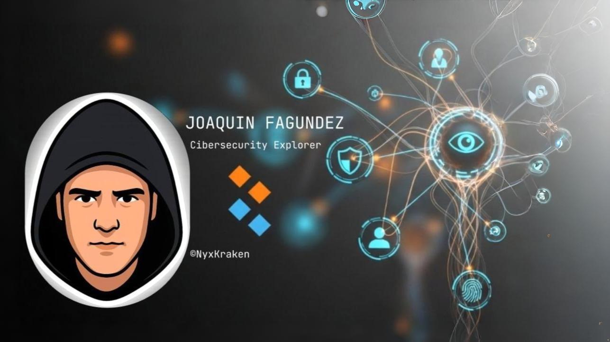

  

# HI , I´M JOAQUIN (NyxKraken)!!!

# 🧠 Cybersecurity Learning Journey – NyxKraken

> *"Tengo arena entre mis manos... todavía no desaté la tormenta."*

---

## 📍 Current Path: `Cyber Security 101` – TryHackMe

Ruta diseñada para fortalecer la base técnica en:
- Redes de computadoras y criptografía
- MS Windows, Active Directory y Linux
- Herramientas ofensivas y explotación básica
- Soluciones defensivas y roles de ciberseguridad

---

### ✅ Completed Modules

| Módulo                          | Descripción                                     | Estado       |
|--------------------------------|-------------------------------------------------|--------------|
| Bash Scripting                 | Variables, arrays, condicionales y automatización Bash | ✅ Completo |
| Pre Security Learning Path     | Fundamentos de redes, Linux, seguridad y hacking | ✅ Completo |
| Search Skills                  | Técnicas OSINT, búsqueda avanzada y filtrado     | ✅ En curso  |
| Start Your Cyber Journey       | Introducción a ciberseguridad ofensiva y defensiva | ✅ En curso  |

---

## 🧱 Skills Adquiridas

- 📁 Comandos y scripting Bash para automatización
- 📡 Conceptos de redes: IP, DNS, puertos, escaneo
- 🧬 Fundamentos de Linux: permisos, procesos, archivos
- 🔍 Pensamiento crítico aplicado a seguridad
- 📜 Análisis lógico + resolución de desafíos TryHackMe

---

## 🚧 Próximos pasos

- 🛡️ Completar `Cyber Security 101`
- 🔓 Iniciar el path `Jr Penetration Tester` o `Complete Beginner`
- 🧪 Profundizar scripting con Python + herramientas ofensivas
- 📂 Comenzar portfolio real con scripts propios y CTFs resueltos

---

## 💡 Filosofía

> "No quiero ser otro que copia código generado por IA.  
> Quiero entender cada línea, cada fallo, cada grieta."

---

## 🐙 Alias de guerra

**NyxKraken** // El que emerge del abismo digital.  
_Creador de AETHERIS, MONOMI y la Biblioteca Kibou._

---

## 🏁 Certificados

- [x] Pre Security Learning Path (TryHackMe)
- [x] Bash Scripting Room
- [ ] Cyber Security 101 (en progreso)

---

_Actualizado: **Julio 2025**_

---
